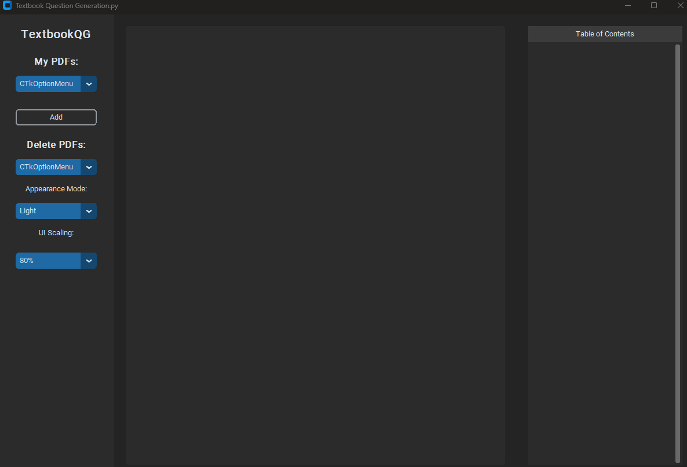
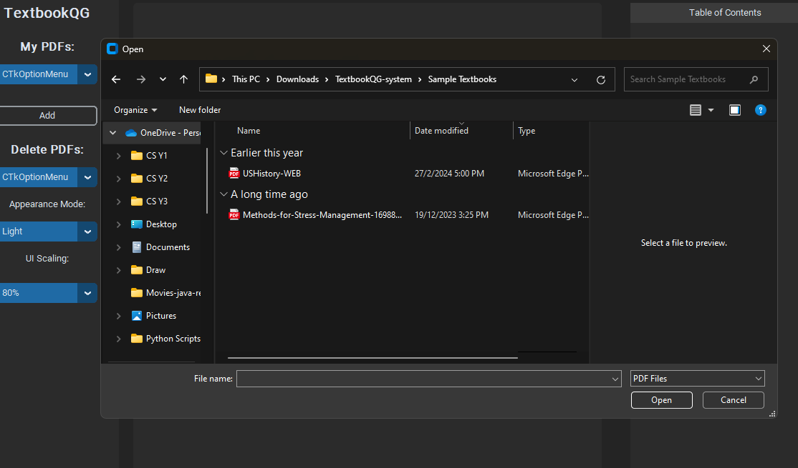
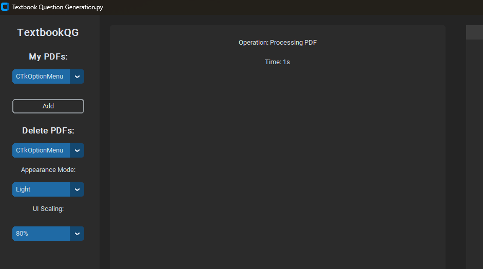
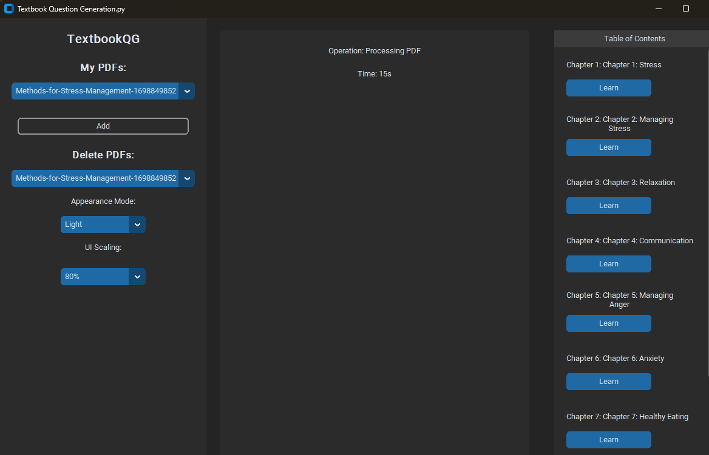
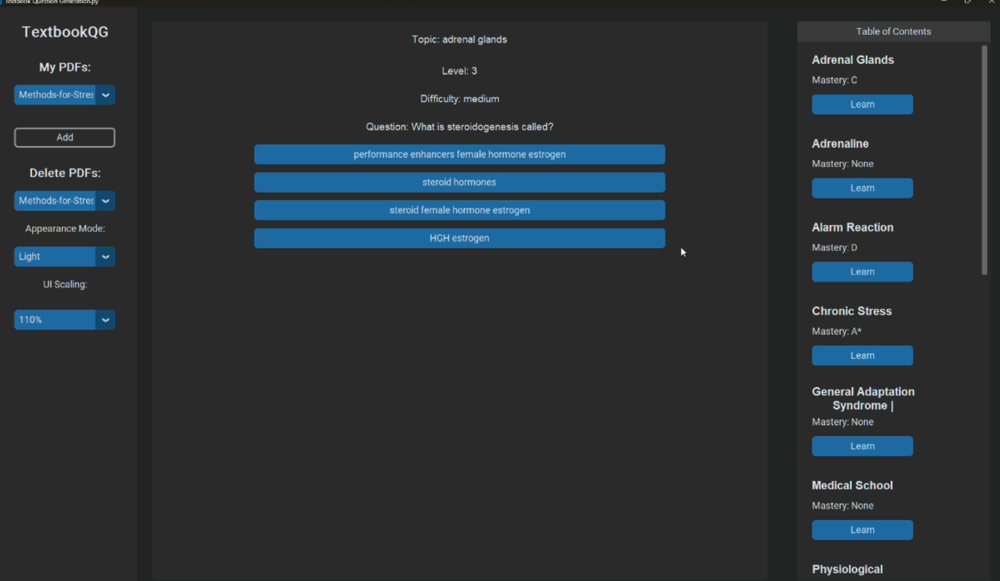
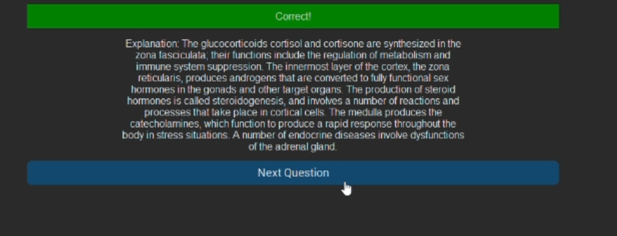
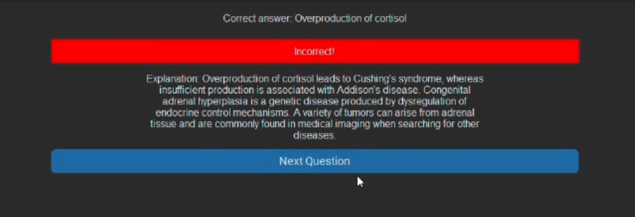
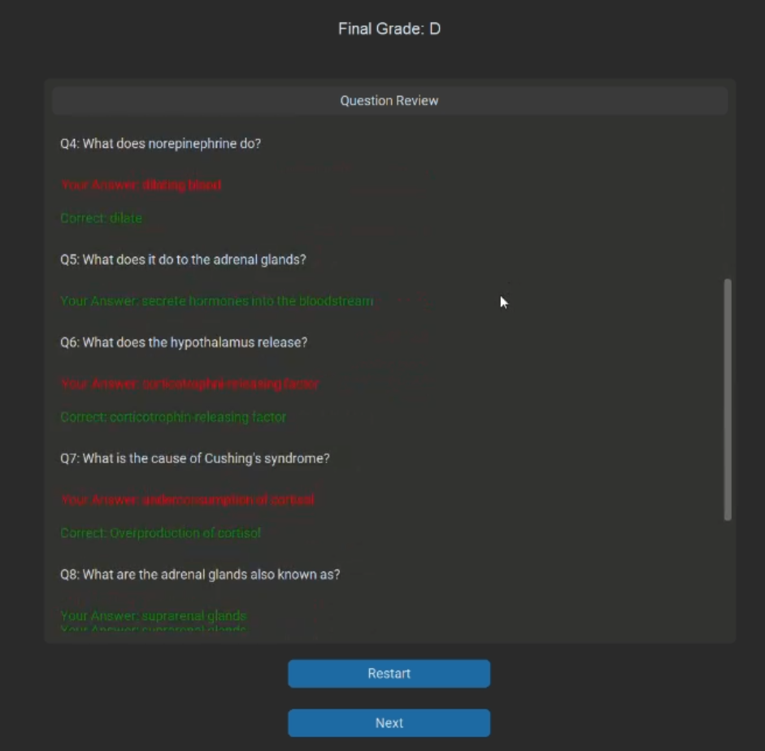
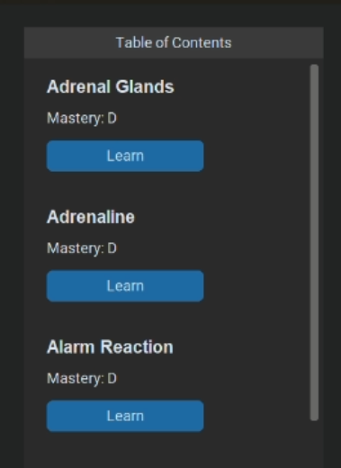

# TextbookQG System

TextbookQG is a Python-based educational tool designed to automatically generate multiple-choice questions from textbook content. This guide will assist you in setting up and running the TextbookQG system on your machine.

## Prerequisites

Before you begin, ensure you have the following installed:
- **Python 3.6+**: Download and install from [python.org](https://www.python.org/downloads/).
- **pip**: Comes installed with Python 3.4 and above.
- **Virtual Environment**: Recommended for managing Python projects.

## Installation Instructions

### Step 1: Extract the Project

Download and extract the TextbookQG-system ZIP folder to your preferred location.

### Step 2: Setup the Virtual Environment

Open a terminal (Linux/macOS) or command prompt (Windows) and navigate to the project directory:

```bash
cd path/to/TextbookQG-system
```

Create a virtual environment:

- **Linux/macOS**:
  ```bash
  python3 -m venv env
  ```

- **Windows**:
  ```cmd
  python -m venv env
  ```

### Step 3: Activate the Virtual Environment

- **Linux/macOS**:
  ```bash
  source env/bin/activate
  ```

- **Windows**:
  ```cmd
  .\env\Scripts\activate
  ```

### Step 4: Install Required Libraries

With the virtual environment activated, install the required libraries:

```bash
pip install -r requirements.txt
```

Note that this process will take some time

## Running the System

With the installation complete, you can now run the TextbookQG system:

```bash
python bin/main.py
```

## Usage

### Upload and Processing 
To use the system, you'll need to upload one of the textbook PDF in the 'Sample Textbooks' folder (Uploading your own textbook PDF is not recommended as the system is likely to run into an error)
- Launch the application and select `Add` to import the PDF.



- Select one of the PDF (Methods-for-Stress-Management is recommended as it takes a shorter time to process)



- Wait for the system to process the PDF



### Generating Exercise

- Once the PDF is done processing, the list of chapters are displayed in the right column



- To start generating exercises, click `Learn` on your selected chapter.


- Wait for the generation to complete, this will take some time (around 20-30 minutes)

### Take the test

- When the list of keywords are displayed in the Table of Contents, you can click on the `Learn` button to start the test



- Select an answer option and the feedback will be shown (correct answer is green and wrong answer is red)




- After 10 questions or lesser, click `End` to review your final grading and performance for all questions



You can choose to relearn the same keyword or proceed to the next one

- Your most recent mastery score / grade will be saved under the keyword




## Deactivating the Virtual Environment

When you're finished, deactivate the virtual environment by running:

```bash
deactivate
```

## Troubleshooting Common Issues

- **Dependency Installation Failures**: Make sure your pip is up to date with `pip install --upgrade pip`. If problems persist, check for specific error messages.
- **Permission Errors**: On Linux or macOS, avoid using `sudo` with pip. Instead, adjust permissions as needed without escalating to superuser privileges.

## Support

For additional support, please contact: hfyxg2@nottingham.edu.my

Thank you for using TextbookQG!
